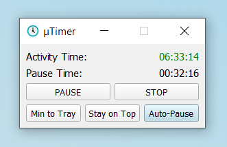

µTimer
======
µTimer is a lightweight timer application for Windows, specifically to help you track your activity and pause times during remote work.

Key Features:

 * *Lock Detection*: Automatically detects when the user locks the computer and transitions into pause mode, ensuring accurate tracking of active work time.
 
 * *Auto-Pause*: Only counts locks longer than a configurable duration (default is 15 minutes) as pauses. This feature ensures that brief interruptions do not impact your overall activity tracking.

 * *History Tracking*: An optional history feature allows you to maintain (and edit!) a record of your past activities, giving you control over your tracking preferences.

After the first start, make sure to check the `user-settings.ini` file to configure these options.

This app is open-source and available at [Github](https://github.com/marifoo/uTimer). The latest pre-compiled release can be found there under *Releases*.

Screenshot
------
 TODO NEW

Info
------

Icon made by [Icons8](https://www.icons8.com) from [www.icons8.com](https://icons8.com/icon/63253/clock)

Build with [Qt 5.14](https://www.qt.io) and MSVC Compiler

License
------
Copyright (c) 2020-2025 marifoo (github.com/marifoo)

Permission is hereby granted, free of charge, to any person obtaining a copy
of this software and associated documentation files (the "Software"), to deal
in the Software without restriction, including without limitation the rights
to use, copy, modify, merge, publish, distribute, sublicense, and/or sell
copies of the Software, and to permit persons to whom the Software is
furnished to do so, subject to the following conditions:

The above copyright notice and this permission notice shall be included in all
copies or substantial portions of the Software.

THE SOFTWARE IS PROVIDED "AS IS", WITHOUT WARRANTY OF ANY KIND, EXPRESS OR
IMPLIED, INCLUDING BUT NOT LIMITED TO THE WARRANTIES OF MERCHANTABILITY,
FITNESS FOR A PARTICULAR PURPOSE AND NONINFRINGEMENT. IN NO EVENT SHALL THE
AUTHORS OR COPYRIGHT HOLDERS BE LIABLE FOR ANY CLAIM, DAMAGES OR OTHER
LIABILITY, WHETHER IN AN ACTION OF CONTRACT, TORT OR OTHERWISE, ARISING FROM,
OUT OF OR IN CONNECTION WITH THE SOFTWARE OR THE USE OR OTHER DEALINGS IN THE
SOFTWARE.
