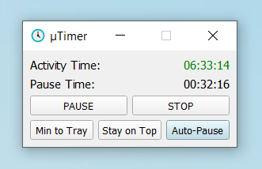

# µTimer

A lightweight desktop timer that tracks your active and pause time and gets
out of your way. Lock your PC, take a break, come back — µTimer keeps the
numbers honest without you having to remember to press anything.



## Features

- **Lock detection.** When you lock the screen, µTimer pauses automatically.
  When you come back, it resumes. No manual click needed.
- **Smart auto-pause.** Short lock-screens (e.g. a quick chat at the door)
  don't count as breaks. Only locks longer than a configurable threshold
  (15 minutes by default) are treated as pauses.
- **Editable history.** Optionally keep a history of past sessions and
  fix-up entries after the fact if you forgot to start or stop the timer.
- **Crash-resilient.** µTimer checkpoints the running session every few
  minutes, so a power cut or unexpected reboot doesn't lose your tracked
  time.
- **Stays out of the way.** Pin-to-top and minimize-to-tray modes; the app
  is small enough to leave in a corner of your screen.

## Install

### Windows

Grab the latest pre-built release from the
[Releases page](https://github.com/marifoo/uTimer/releases) and run the
executable. No installer, no admin rights — just drop it in a folder and
start it.

### Linux (build from source)

There is no pre-built binary for Linux, but the app builds and runs on it.
You will need Qt 5 (5.14 or later), a recent GCC, and `qmake`:

```sh
qmake uTimer.pro
make
./uTimer
```

Lock detection on Linux uses D-Bus — systemd-logind, GNOME, KDE, or the
generic freedesktop screensaver, whichever responds first.

## Using it

The main window shows your accumulated **Activity** and **Pause** time for
the current day, plus the time you started.

- **Start / Pause / Stop** — the obvious controls.
- **History** — opens a dialog where you can browse past days and edit
  entries (split a segment, change Activity↔Pause, etc.).
- **Auto-Pause** — toggles whether long locks count as pauses.
- **Pin / Tray** — keeps the window on top, or hides it to the system tray.

µTimer resets at midnight and writes each day's totals to its history.

## Settings

After the first launch, a `user-settings.ini` file appears next to the
binary. The interesting keys:

| Key | Default | What it does |
| --- | --- | --- |
| `autopause_enabled` | `true` | Master switch for auto-pause. |
| `autopause_threshold_minutes` | `15` | Locks shorter than this stay counted as Activity. |
| `history_days_to_keep` | `99` | How many days of history to retain. `0` disables history entirely. |
| `press_start_button_on_app_start` | `true` | Start the timer automatically on launch. |
| `start_minimized_to_tray` | `false` | Launch hidden in the system tray. |
| `start_pinned_to_top` | `false` | Launch with always-on-top enabled. |
| `show_warning_after_9h45min_activity` | `false` | Nudge after a long active stretch. |
| `show_warning_when_not_30min_pause_after_6h_activity` | `false` | Nudge if you haven't taken a real break. |

## For contributors

If you are looking at the source rather than just running the app, see
[`doc/`](doc/README.md) for architecture and design documentation.

## Credits

- Icon by [Icons8](https://icons8.com/icon/63253/clock).
- Built with [Qt 5](https://www.qt.io) (see [`QT-LICENSE.md`](QT-LICENSE.md)).

## License

Copyright (c) 2020-2026 marifoo (github.com/marifoo)

Permission is hereby granted, free of charge, to any person obtaining a copy
of this software and associated documentation files (the "Software"), to deal
in the Software without restriction, including without limitation the rights
to use, copy, modify, merge, publish, distribute, sublicense, and/or sell
copies of the Software, and to permit persons to whom the Software is
furnished to do so, subject to the following conditions:

The above copyright notice and this permission notice shall be included in all
copies or substantial portions of the Software.

THE SOFTWARE IS PROVIDED "AS IS", WITHOUT WARRANTY OF ANY KIND, EXPRESS OR
IMPLIED, INCLUDING BUT NOT LIMITED TO THE WARRANTIES OF MERCHANTABILITY,
FITNESS FOR A PARTICULAR PURPOSE AND NONINFRINGEMENT. IN NO EVENT SHALL THE
AUTHORS OR COPYRIGHT HOLDERS BE LIABLE FOR ANY CLAIM, DAMAGES OR OTHER
LIABILITY, WHETHER IN AN ACTION OF CONTRACT, TORT OR OTHERWISE, ARISING FROM,
OUT OF OR IN CONNECTION WITH THE SOFTWARE OR THE USE OR OTHER DEALINGS IN THE
SOFTWARE.
