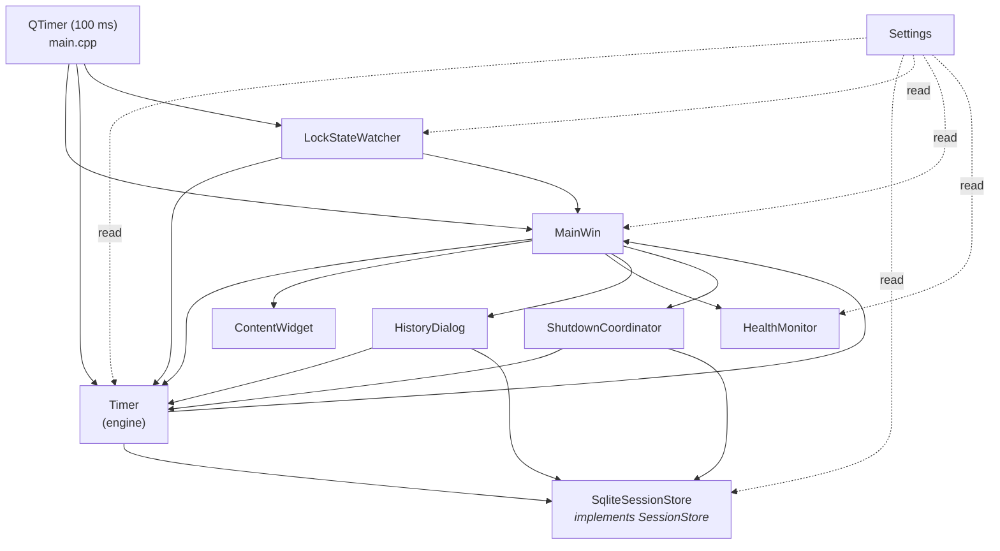
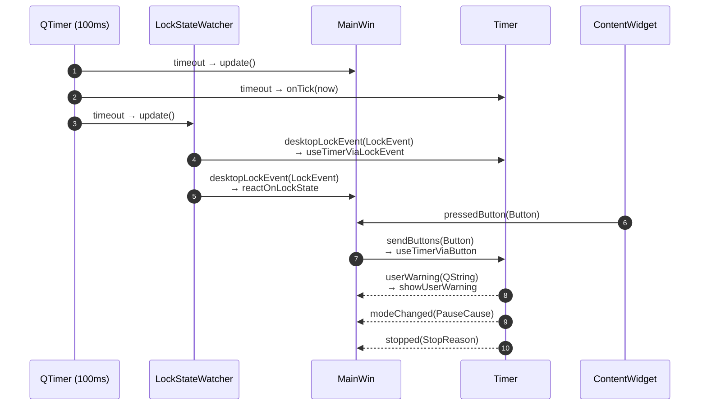

# Architecture

µTimer is a single-process Qt desktop application. There are **no threads of
our own** — everything runs on the Qt event loop driven by a 100 ms heartbeat
`QTimer` constructed in `main.cpp`. The components below are plain C++ objects
owned on the stack of `main()`; they communicate through Qt signals/slots
wired in the same function.

## Component overview

Each box in one or two lines:

- **`Settings`** — thin wrapper around the `user-settings.ini` file. Read-only
  reference passed to every component that needs configuration.
- **`LockStateWatcher`** — abstracts OS lock detection (see below). Emits
  `desktopLockEvent(LockEvent)` on lock/unlock/long-lock transitions.
- **`SessionStore`** — abstract persistence interface. The concrete
  implementation `SqliteSessionStore` is the only one in the production binary;
  the test harness substitutes `FakeSessionStore` (see `qtest/`). See
  `persistence.md` for the storage model.
- **`Timer`** — the timing engine and state machine. Owns the session in
  memory, drives checkpoints, talks to `SessionStore` for persistence, and
  emits `stopped`, `modeChanged`, `userWarning` for the GUI to follow.
- **`ShutdownCoordinator`** — runs the shutdown sequence (see
  `runtime-behaviour.md`). Holds references to `Timer` and `SessionStore`;
  does not depend on any GUI class.
- **`MainWin`** — the top-level Qt window. Owns the tray icon, the
  `ContentWidget`, the `HealthMonitor`, and the `HistoryDialog` when open.
  Wires the Qt-side signals to the engine.
- **`ContentWidget`** — the central widget: time labels, Start/Pause/Stop
  buttons, history/autopause/pin/min-to-tray buttons.
- **`HealthMonitor`** — watches accumulated active / pause time per session
  and emits `warningTriggered` if a configurable threshold is exceeded.
- **`HistoryDialog`** — modal editor for the persisted timeline; opens
  lazily from `MainWin`.

## The `SessionStore` abstraction

`SessionStore` (in `sessionstore.h`) is a pure-virtual interface listing every
DB operation `Timer` actually calls. `Timer` holds a `SessionStore&` reference,
not a `SqliteSessionStore&`. The seam exists for one reason:
**testability**. In `qtest/` the engine runs against an in-memory
`FakeSessionStore` that records calls and lets tests inject failure modes
without touching disk or SQLite. The interface is small and chosen to expose
*intent* rather than SQL: `commitSession`, `saveCheckpoint`,
`loadDurations`, `loadUnfinalizedCheckpoints`,
`reconcileUnfinalizedCheckpoints`, the clean-shutdown marker, and so on.

## What each module hides

| Module             | Hides from its callers                                                                              |
| ------------------ | --------------------------------------------------------------------------------------------------- |
| `Timer`            | The Activity/Pause/None FSM, the midnight policy, the checkpoint cadence, and `SessionState` mutations |
| `SessionStore`     | SQLite, transactions, the `is_finalized` flag, segment-id/orphan bookkeeping, backups, retention   |
| `Timeline`         | Segment normalization, ordering, and the ongoing-segment splice in `activeMsec`/`pauseMsec`         |
| `LockStateWatcher` | The OS API (`WTSSESSION_CHANGE` on Windows, several D-Bus backends on Linux) and the debounce buffer |
| `HealthMonitor`    | The "show each warning at most once per session" thresholds                                        |
| `MainWin`          | Tray, window flags, message boxes, native event plumbing                                            |

## Domain vs Qt-glue

The application logic lives in **`Timer`**, **`SessionStore`**, **`Timeline`**,
and **`HealthMonitor`** — these compile and run without a `QApplication` and
are exercised that way by the test harness. **`MainWin`** and
**`ContentWidget`** are pure Qt glue: tray icon, layouts, widget signals,
signal-to-slot routing. When you are looking for *behaviour*, start in the
first group; when you are looking for *layout or wiring*, start in the second.

## Single-rule, single-site reference

Each cross-cutting rule is owned by one class. When a question comes up, go
straight to the owner:

| Concern                                    | Owner                                |
| ------------------------------------------ | ------------------------------------ |
| Midnight policy (cross-day cutoff)         | `Timer` via `DayBoundaryWatcher`     |
| Autopause / lock-driven auto-resume        | `Timer` (signalled via `modeChanged`)|
| Checkpoint cadence                         | `Timer`                              |
| Orphan checkpoint reconciliation           | `SessionStore` + `Timer` (decision)  |
| Clean-shutdown marker                      | `ShutdownCoordinator` + `SessionStore` |
| Database schema, migrations, retention     | `SqliteSessionStore`                 |
| OS lock detection                          | `LockStateWatcher`                   |
| Shutdown sequence (orchestration)          | `ShutdownCoordinator`                |
| Health warnings (long activity / pause)    | `HealthMonitor`                      |

## Lock detection

`LockStateWatcher` is the single boundary between the application and the OS's
notion of "the desktop is locked". On Windows it consumes
`WTSSESSION_CHANGE` notifications (via `MainWin::nativeEvent`). On Linux it
tries several D-Bus backends in order — `systemd-logind`, the freedesktop
screensaver, the GNOME screensaver, then the KDE screensaver — and uses the
first one that responds; the exact order and method names live in
`lockstatewatcher.cpp` (`LinuxLockMethod`). The watcher polls on each 100 ms
heartbeat, runs the raw boolean through a 5-tick debounce buffer
(`buffer_for_lock` / `buffer_for_unlock`), and emits one of
`None`/`Unlock`/`Lock`/`LongOngoingLock`. `LongOngoingLock` is the
"the lock has now been held long enough to be a real pause" signal, which is
what triggers the backpause behaviour in `Timer`.

## Signal/slot wiring

The connections set up at the bottom of `main()` are:

`MainWin::onAboutToQuit` is wired separately to
`QCoreApplication::aboutToQuit`; it delegates to `ShutdownCoordinator`. On
Linux, a `QSocketNotifier` reading from a `socketpair` translates
`SIGTERM`/`SIGINT`/`SIGHUP` into the same shutdown call — see
`runtime-behaviour.md`.
