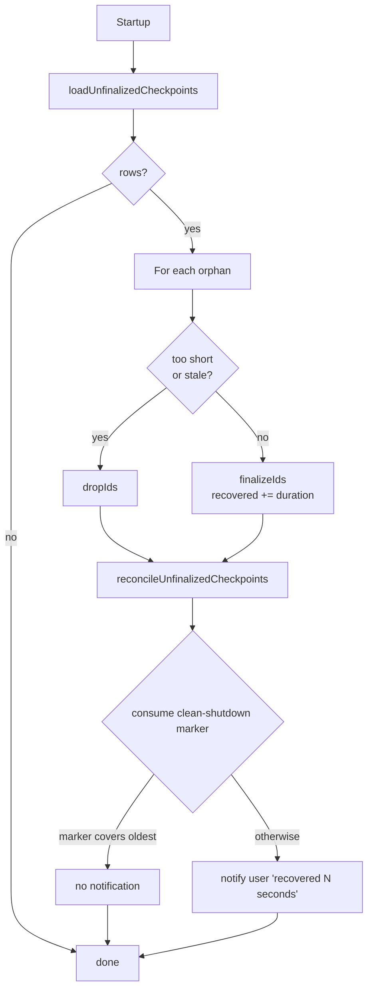

# Persistence

µTimer stores its history in a single SQLite file, `uTimer.sqlite`, that
lives next to the binary. There is no server, no migration tooling, and no
external client — `SqliteSessionStore` is the only thing that reads or
writes it. The schema is checked at startup via `checkSchemaOnStartup()`,
which returns a `SchemaStatus` enum (`Ready`, `Created`, `Outdated`, or
`Inaccessible`). If the result is `Outdated` or `Inaccessible`, the
application refuses to start and asks the user to delete or rename the file.
Only on `Ready` or `Created` does `main.cpp` call `Timer::initializeFromStore()`
to consume the clean-shutdown marker and reconcile orphan checkpoints.

This document is the storage model. For the seam it sits behind, see the
`SessionStore` section in `architecture.md`.

## Tables

The schema is created on first open by `ensureSchema` in
`sqlitesessionstore.cpp`. Two tables:

- **`durations`** — the timeline of completed and in-progress segments. One
  row per segment, identified by a stable `segment_id` (UUID). Columns:
    - `id` (autoincrement primary key)
    - `segment_id` (UUID, `UNIQUE`) — stable across edits and reloads; the
      key Timer uses to update an existing segment instead of inserting a
      new one.
    - `type` (`0` = Activity, `1` = Pause; mirrors `DurationType`).
    - `start_utc`, `end_utc` — segment start and end, stored as ISO-8601
      UTC text (`Qt::ISODateWithMs`). Converted back to local time on
      load; the segment duration is computed from these, not stored.
    - `is_finalized` (`1` = a completed segment, `0` = an in-progress
      checkpoint). Discussed below.
- **`app_settings`** — a key/value table for lifecycle markers. Currently
  the only entry is `last_clean_shutdown`, written by
  `ShutdownCoordinator` and consumed on the next startup by `Timer`.

Indices: `idx_start_utc` on `durations.start_utc`, a partial index
restricted to `WHERE is_finalized = 1` (used by `hasEntriesForDate` and
orphan overlap probing), and `idx_segment_id` on `durations.segment_id`
(used by every checkpoint/upsert write path).

Journal mode is the SQLite default (rollback journal, **not** WAL).
Single-process, single-threaded apps gain nothing from WAL, and rollback
journal keeps the database as a single file — no `-wal`/`-shm` sidecars to
forget when backing up or copying the database elsewhere. `ensureSchema` sets
`PRAGMA synchronous=NORMAL`; `flushToDisc` temporarily promotes to `FULL`
during shutdown so the final write is durably on disk before the process
exits.

## Checkpoints

A checkpoint is a periodic save of the **in-progress** Activity segment.
The cadence is `checkpoint_interval_min_` from settings (5 minutes by
default; `0` disables checkpoints entirely). On each tick of
`Timer::checkpointTimer_`, the engine calls
`SessionStore::saveCheckpoint(...)` with the current `segment_id`. The store
treats this as an upsert keyed by `segment_id`:

- If a row with that `segment_id` already exists, its `end_utc` is updated
  and `is_finalized` is forced to `0` so the row remains "in-progress".
- Otherwise, a new row is inserted with `is_finalized = 0`.

When the segment closes (the user stops, autopause kicks in, or the
day-boundary watcher fires), `Timer` calls `commitSession`, which goes
through `updateDurationsById`. That path writes `is_finalized = 1` for the
same `segment_id`, atomically promoting the checkpoint row to a finalized
entry — no second row is created, no orphan is left behind.

Checkpoints exist for crash recovery: if the process dies between
checkpoint-and-finalize, the next startup can recover most of the
in-progress segment from the unfinalized row. They are deliberately cheap —
`saveCheckpoint` does not create the `.backup` / `.durations.txt` snapshot
that `saveDurations`/`replaceAll` produce, because at a 5-minute cadence
that would generate hundreds of files per day.

## Orphan reconciliation on startup

After a crash, an "orphan" is a row left with `is_finalized = 0` that no
running process can claim. On startup, `Timer` runs the reconciliation in
two steps (see `timer.cpp` `reconcileOrphanCheckpoints`):

1. **Load** — `SessionStore::loadUnfinalizedCheckpoints()` returns every
   row with `is_finalized = 0`, in id order.
2. **Decide** — for each orphan, `Timer` decides whether to **finalize** it
   (treat the last known endpoint as the segment's true end and recover the
   time) or **drop** it (delete it without crediting any time). Today the
   decision is:
      - Drop if `duration < 1 second` — too short to be a real session.
      - Drop if `endTime` is more than 24 hours old — too stale to trust.
      - Otherwise finalize.
3. **Apply** — `SessionStore::reconcileUnfinalizedCheckpoints(toFinalize,
   dropIds)` first `DELETE`s the drop list in a single transaction, then
   finalizes each remaining orphan individually via `finalizeIfNoOverlap`,
   each in its own transaction. An orphan is finalized (`UPDATE … SET
   is_finalized = 1`) only if no already-finalized row overlaps its
   `[start_utc, end_utc)` interval; overlapping orphans are left untouched.

The **clean-shutdown marker** controls whether the user sees a recovery
notification afterwards. `ShutdownCoordinator` writes
`last_clean_shutdown = now` only when the session drained cleanly
(`Timer::canMarkCleanShutdown()`). On the next startup, `Timer` reads and
consumes the marker (it is deleted on read). If the marker is at or after
the oldest finalized orphan's end time, that means the orphan was already
covered by a clean stop and the user does not need a "recovered N seconds"
notification — only genuinely-crashed recoveries surface in the UI.

## What is inside the `SessionStore` seam — and what is not

Everything in this document — the SQL, the transactions, the
`is_finalized` flag, the orphan-id bookkeeping, the backup files, retention
cleanup, schema migrations — lives **inside** `SqliteSessionStore`. None of
it crosses the interface defined in `sessionstore.h`. `Timer` only sees
`commitSession`, `saveCheckpoint`, `loadDurations`,
`loadUnfinalizedCheckpoints`, `reconcileUnfinalizedCheckpoints`, the
clean-shutdown marker pair, `flushToDisc`, and `checkSchemaOnStartup`. That
is what makes `FakeSessionStore` in `qtest/` viable: it can re-implement the
interface in pure C++ data structures and the engine code is none the wiser.
