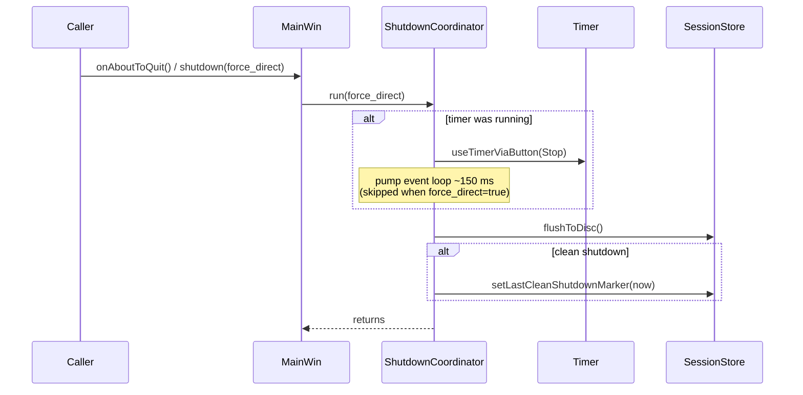

# Runtime behaviour

This document covers what happens *while µTimer is running*: the state
machine, the heartbeat that ticks it, how cross-midnight cases are handled,
and how shutdown is orchestrated. For *what the components are*, see
`architecture.md`; for *what is stored on disk*, see `persistence.md`.

## Timer state machine

`Timer` runs three modes: `None` (stopped), `Activity`, and `Pause`.
Transitions are driven by user buttons, lock events from
`LockStateWatcher`, and the `DayBoundaryWatcher` at the day boundary.

```mermaid
stateDiagram-v2
    [*] --> None

    None --> Activity : Button::Start

    Activity --> Pause : Button::Pause<br/>LockEvent::LongOngoingLock
    Pause --> Activity : Button::Start<br/>LockEvent::Unlock<br/>(if was active before autopause)

    Activity --> None : Button::Stop<br/>DayBoundaryWatcher (scheduled / watchdog)
    Pause --> None : Button::Stop<br/>DayBoundaryWatcher (scheduled / watchdog)
```

Two enums on `Timer` annotate the transitions so the GUI can react without
keeping its own state:

- `Timer::StopReason` (`ButtonStop`, `MidnightScheduled`, `MidnightWatchdog`,
  `Shutdown`, `EditApplied`) — carried by `stopped()`.
- `Timer::PauseCause` (`UserAction`, `LockAutopause`, `LockResume`) —
  carried by `modeChanged()`. Lets `MainWin` distinguish user-driven pauses
  from lock-driven autopause.

`Lock` (without "Long") does **not** transition the engine on its own; it
suspends checkpoints (so checkpoints do not move while the user is away) and
arms `LockStateWatcher`'s internal lock timer. Only `LongOngoingLock`
crosses the threshold and triggers autopause inside `Timer`.

## The 100 ms heartbeat

A single `QTimer` in `main.cpp` ticks every 100 ms. Three slots are wired to
its `timeout()` signal:

1. **`MainWin::update`** — refreshes the time labels and tooltips by reading
   the current snapshot from `Timer`.
2. **`Timer::onTick`** — calls `DayBoundaryWatcher::tick` (the cross-midnight
   watchdog). This is the *only* path that runs `Timer` code from the
   heartbeat; mode transitions are still driven exclusively by buttons and
   lock events.
3. **`LockStateWatcher::update`** — polls the OS lock state, pushes the
   boolean through the 5-tick debounce buffer, and emits at most one
   `desktopLockEvent` per tick.

Why 100 ms? It is fast enough to keep the time labels visibly fluid, fast
enough that the lock debounce window is well under a second, and slow enough
not to register on a CPU profile.

## `SessionState`

`Timer` groups its mutable per-session data into the `SessionState` struct
(see `timer.h`). The rationale is documented in the header comment and is
worth quoting rather than restating: previously these fields were scattered
as raw members, making it easy for code paths to mutate them as side-effects.
Grouping them into a struct with explicit, named transition methods
(`beginNewSegment`, `clearSegment`, `markUnsaved`, …) ensures every mutation
is logged at debug level and is therefore traceable in the log output.

The struct is owned by `Timer` and is not exposed to callers — `Timeline`
is the read-only view that `MainWin` and `HistoryDialog` consume via
`Timer::snapshot()`.

## Cross-midnight handling

A session must never contain a segment that spans two dates: the persistence
layer indexes by `start_date` and `end_date`, and downstream UI groups by
date. `Timer` enforces this with a single dedicated subsystem:
`DayBoundaryWatcher`. It uses two mechanisms together:

1. **Scheduled stop** — a single-shot `QTimer` armed for **23:59:59.500**
   today (`armScheduledStop`). When it fires, the engine stops with
   `StopReason::MidnightScheduled`.
2. **Watchdog** — `DayBoundaryWatcher::tick` runs on every 100 ms heartbeat
   and checks whether the ongoing segment has crossed midnight (which can
   happen if the machine slept past the scheduled time). If so, it forces
   the engine into `None` and discards the in-flight segment, emitting
   `StopReason::MidnightWatchdog`.

A last-line defence in `Timer::addDuration` silently discards any segment
whose `startTime.date() != endTime.date()`. In normal operation the two
mechanisms above make that branch unreachable; it exists so that a logic
bug elsewhere cannot poison the in-memory session or the database.

`MainWin` has **no** midnight logic. It reacts to `stopped(StopReason)` like
any other stop.

## Shutdown flow

The shutdown sequence is owned by `ShutdownCoordinator`. It can be triggered
from three places:

- Normal close (`MainWin::closeEvent`, tray-menu Quit) →
  `MainWin::onAboutToQuit` (wired to `QCoreApplication::aboutToQuit`).
- Windows session end (`WM_QUERYENDSESSION` / `WM_ENDSESSION` handled in
  `MainWin::nativeEvent`) → `MainWin::shutdown(true)` with the
  `force_direct` path so the event loop is not relied on.
- Linux signal (`SIGTERM` / `SIGINT` / `SIGHUP`) → `MainWin::onAboutToQuit`
  via the signal-handling pattern described below.



`ShutdownCoordinator::run` is idempotent (`shutdown_completed_` guard) so
multiple triggers fire it exactly once. The clean-shutdown marker is only
written when `Timer::canMarkCleanShutdown()` reports that the session was
fully drained — this is what lets the next startup distinguish "we left
checkpoints behind because we crashed" from "we left checkpoints behind
because we shut down before flushing"; see `persistence.md` for how that
distinction is used.

### Linux: Unix signals via socketpair

Signal handlers may only call async-signal-safe functions, so the handler in
`main.cpp` does the bare minimum: it writes the signal number to one end of
a `socketpair`. A `QSocketNotifier` watches the other end and, inside the
event loop, reads the byte and calls `MainWin::onAboutToQuit` followed by
`QCoreApplication::quit`. This is the standard Qt pattern for
signal-to-event-loop bridging; it lives in `main.cpp` because it has to be
installed *before* `QApplication` is constructed. On Windows the same role
is filled by the `WM_QUERYENDSESSION` / `WM_ENDSESSION` path in
`MainWin::nativeEvent`, which calls `shutdown(true)` directly.

This is the one place where the platform difference matters for runtime
behaviour — the rest of the code is portable.
